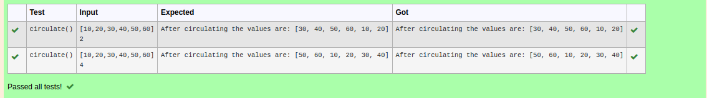

# Circulate-the-values-of-N-variables
## Aim:
To write a python program to circulate the n variables using function concept
## Equipment’s required:
PC
Anaconda - Python 3.7
## Algorithm: 
### Step 1: 
commence the program
### Step 2: 
get the value from the user for the number of rotation
### Step 3: 
Get the value from the user for the number of rotation
### Step 4: 
Using the slicing concept rotate the list

### Step 5: 
print the rotated list
### Step 6: 
end the program
## Program:
```python
#Program to circulate N values.
#Developed by: SaileshKumar A
#RegisterNumber:22003843
def circulate():
    a=eval(input())
    n=int(input())
    m=a[n:]+a[:n]
    print('After circulating the values are:',m)
```

## Output:



## Result:
the variables are rotated sucessfully.